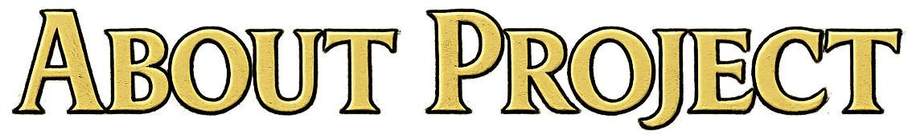
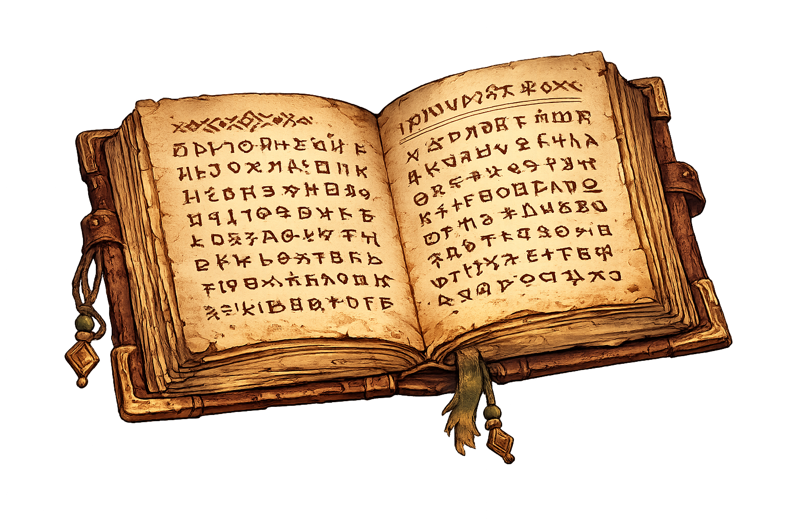
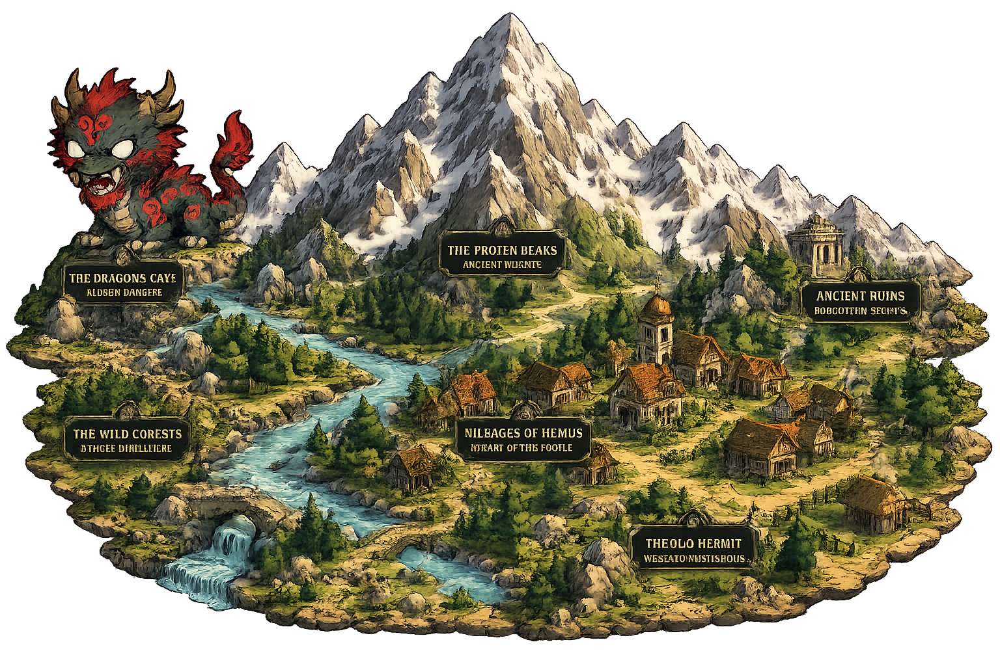
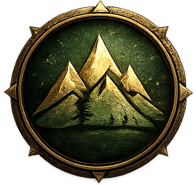
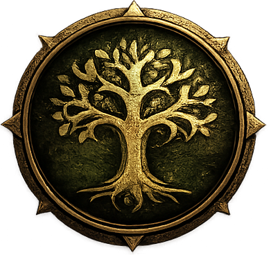
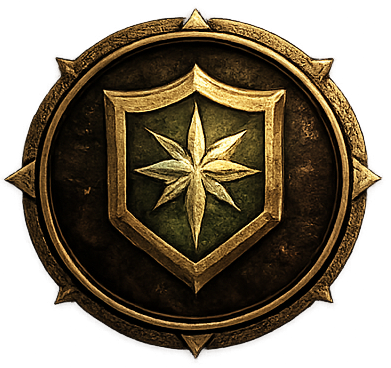
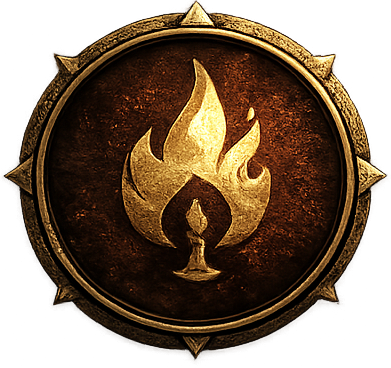

  
  
  
  

---

<table>
<tr>
<td width="65%" valign="top">

**Valley of Hemus** is a personal project created with two main goals.

The first goal is to deepen my **SQL** knowledge by building something far beyond a typical CRUD application. Instead of using SQL only for data storage, I wanted to explore how far a relational database could be pushed and whether it could drive the core mechanics of an entire game.

The second goal is to demonstrate that a relational database can become the game's backend rather than simply serving as a persistence layer.

In this project, all game logic is executed inside **SQLite**.

Player actions are written to a command queue, processed by **SQL triggers**, and the resulting game state is then rendered by **LÖVE2D**.

The most unusual aspect of this project is that SQLite does not support stored procedures. To overcome this limitation, the entire backend is implemented using SQLite triggers, making every game mechanic entirely database-driven.

**LÖVE2D** serves as the presentation layer, responsible for rendering the world, handling player input, and displaying the current game state. Every gameplay decision—including combat, movement, inventory management, and quests—is executed inside **SQLite**.

Besides improving my SQL skills, this project is also an opportunity to gain experience with the technical and business aspects of game development. My long-term goal is to publish the game on Steam and document the entire journey here.

</td>

<td width="35%" align="center">

</td>
</tr>
</table>

---

<table>
<tr>

<td width="60%" align="center">

</td>

<td width="65%" valign="top">

<table>

<tr>
<td width="55" valign="center">

</td>

<td>

#### A LAND SHAPED BY MYTH
Hemus is a realm inspired by ancient Bulgarian folklore, where nature
breathes, spirits wander, and forgotten powers sleep beneath the
earth. From the misty peaks to the deep forests, every place holds
a story — and a secret.

</td>
</tr>

<tr>
<td width="55" valign="center">

</td>

<td>

#### LEGENDS WALK THESE LANDS

Karakondjuli, Samodivi, Kukeri, and other creatures of myth roam
these lands. Some are guardians. Others are ancient evils. All of
them are part of a world where the line between myth and reality
has long been blurred.

</td>
</tr>

<tr>
<td width="55" valign="center">

</td>

<td>

#### A WORLD FULL OF CHOICES

Your journey is not written. You choose your path. Will you be
a warrior, a wanderer, or someone who listens to the whispers
of the old gods? Your decisions shape the fate of Hemus.

</td>
</tr>

<tr>
<td width="55" valign="center">

</td>

<td>

#### MORE THAN AN ADVENTURE

The World of Hemus is more than a game — it’s a tribute to
a rich cultural heritage, reimagined through interactive storytelling,
challenging battles, and meaningful choices.

</td>
</tr>

</table>

</td>

</tr>
</table>

